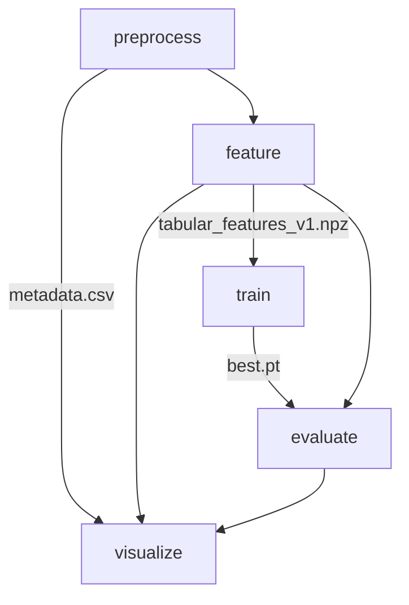

# Pipeline

Mục tiêu: chuyển notebook đơn lẻ thành pipeline có thể chạy từng bước độc lập, có cache, logging, checkpointing, và output rõ ràng.

## Tổng quan (stages)

Bạn chạy bằng:

```bash
python src/main.py --stage preprocess
python src/main.py --stage feature
python src/main.py --stage train
python src/main.py --stage evaluate
python src/main.py --stage visualize
python src/main.py --stage full
```

Hoặc:

```bash
make full RUN_NAME=exp01
```

## 1) `preprocess`

**Input**
- `Data/genres_original/<genre>/*.wav`

**Output**
- `data/processed/metadata.csv`

**Nội dung**
- Quét toàn bộ file `.wav`, lấy `sample_rate`, `frames`, `duration_sec`.
- Mục đích: dataset EDA + phát hiện bất thường (duration lệch, sample_rate lệch, file lỗi).

## 2) `feature`

**Input**
- `Data/features_3_sec.csv` (đã được extract sẵn trong dataset GTZAN Kaggle mirror)

**Output**
- `data/splits/split_v1.csv`
- `data/features/tabular_features_v1.npz`
- `data/features/tabular_scaler.pkl`
- `data/features/label_map.json`

**Nội dung**
- Tạo `train/val/test` split (stratified) theo `label`.
- `LabelEncoder` fit trên `train`.
- `StandardScaler` fit trên `train` và transform cho `train/val/test`.
- Cache ra `.npz` để:
  - tái lập thí nghiệm nhanh
  - tách rời training khỏi IO/ETL

### Hai chế độ feature

Pipeline hỗ trợ 2 kiểu feature, chọn bằng `features.kind` trong `configs/config.yaml`:

1) `tabular_csv` (mặc định, giống notebook)
- đọc `Data/features_3_sec.csv`
- split theo từng segment row

2) `mel_from_audio` (end-to-end)
- đọc raw wav từ `Data/genres_original/<genre>/*.wav`
- cắt mỗi track thành các segment `segment_seconds` (mặc định 3s)
- extract mel-spectrogram cho từng segment
- split theo **group track** (tránh leakage: segment của cùng bài không bị rơi vào nhiều split)

## 3) `train`

**Input**
- `data/features/tabular_features_v1.npz`

**Output**
- `outputs/<run_name>/checkpoints/best.pt`
- `outputs/<run_name>/reports/history.json`
- `outputs/<run_name>/figures/training_curves.png`

**Nội dung**
- Train classifier theo architecture trong `configs/model.yaml` (mặc định: `mlp`).
- Loss: Cross Entropy (tương đương `sparse_categorical_crossentropy` trong notebook).
- Early stopping theo `configs/config.yaml`.
- Checkpointing theo metric (mặc định: `val_loss`).

### Classical ML baselines

Ngoài `mlp`, pipeline hỗ trợ các model sklearn:
- `knn`, `svm_rbf`, `linear_svm`, `logreg`, `naive_bayes`, `lda`, `qda`
- `random_forest`, `extra_trees`, `ada_boost`, `gbdt`
- `xgboost`, `lightgbm` (optional deps)

Checkpoint sẽ được lưu tại:
- `outputs/<run_name>/checkpoints/model.joblib`

Lưu ý: sklearn models không có epoch/training curves; pipeline sẽ lưu `reports/sklearn_train_metrics.json` (val accuracy / val log-loss nếu có).

## 4) `evaluate`

**Input**
- Cached features
- Checkpoint `best.pt`

**Output**
- `outputs/<run_name>/reports/evaluation_report.md`
- `outputs/<run_name>/reports/misclassified.csv`
- `outputs/<run_name>/figures/confusion_matrix.png`

**Nội dung**
- Predict trên test set.
- Metrics: accuracy, macro-F1, weighted-F1, ROC-AUC (OvR macro nếu tính được).
- Confusion matrix (normalized) + bảng misclassified để làm error analysis.
- Nếu model có `predict_proba` (MLP / KNN / SVM(probability) / LogReg / RF …), pipeline sẽ sinh thêm ROC/PR curves:
  - `outputs/<run_name>/figures/roc_ovr.png`
  - `outputs/<run_name>/figures/pr_ovr.png`

## Thứ tự chạy khuyến nghị

### Track A: tabular CSV (giữ logic notebook)


### Track B: raw audio -> mel -> CNN/LSTM


## 5) `visualize`

**Input**
- `data/processed/metadata.csv` (nếu có)
- cached features
- raw audio

**Output**
- `outputs/<run_name>/figures/*`

**Nội dung**
- Dataset plots: genre distribution, duration, sample-rate.
- Feature analysis: correlation heatmap, PCA/t-SNE/UMAP embeddings.
- Audio visualizations: waveform, STFT, mel spectrogram, MFCC, chromagram, spectral contrast, tempogram, HPSS.

## Dependency graph


